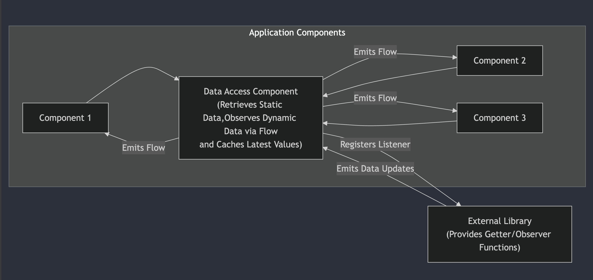

## Task 1:

You are working on an Android application using Kotlin that interacts with a third-party Java/Kotlin
library providing various getter and observer functions (about 100 of them, and more can be added
over time). These functions return or notify data values of various data types (e.g., int, float,
double, complex types), with some parameters being static and others dynamic (changing during
runtime). The data from this library needs to be accessed by multiple distinct software components
within the Android app, such as separate modules or libraries. In this context, how would you design
a solution to connect the data provider with the components that need the data? Please consider the
following aspects:

* Data may not be immediately available at application startup

* Data clients can request data at any time during runtime

* Data should not be lost (e.g., when a client connects to a dynamic data source, it should always
  receive something, for example, the last encountered value)

* The solution must be scalable, allowing for easy addition of new functions/observers (static or
  dynamic)

Code (pseudo or otherwise) is not mandatory but welcomed. Multiple solution propositions are
possible. Define a few of the pros/cons of each solution in this case, and the criteria for when to
select a solution over the other.

## Solution: Centralized Data Access with Kotlin Coroutines Flow

My solution is to create a dedicated component, which I’ll call the Data Access Component, to handle
all interactions with the external library. This component will offer a simplified, reactive
interface for the other components in the application. I believe that this approach, along with the
capabilities of Kotlin Coroutines and Flows, will enable the application to reach the desired level
of abstraction, efficiency, and scalability.

**Architecture Overview:**



**Component Breakdown:**

* **The Data Access Component** serves as the main interface for accessing data from the external library.
It provides a simple API that simplifies the complexities of the library's interface. Utilizing
Kotlin Coroutines and StateFlow, it manages dynamic data streams, ensuring that the most recent
values are cached and updates are efficiently communicated to subscribed components.

* **The External Library** is the third-party library we need to integrate. It offers functions for data
retrieval and mechanisms, such as callbacks or listener interfaces, for monitoring changes.

* **Application Components** refer to the various modules or libraries within the Android app that need
data from the external library. They interact with the Data Access Component to fetch data and
subscribe to dynamic updates through Kotlin Coroutines Flows.

Upon application startup, the Data Access Component is initialized. For static data, components
invoke the relevant method on the Data Access Component, which then communicates with the external
library to obtain the data. For dynamic data, the Data Access Component establishes StateFlow
instances, creating reactive pipelines for updates. It also registers itself as a listener with the
library for these dynamic data points. When the library sends out data updates, the Data Access
Component refreshes the StateFlow values and triggers emissions to all subscribed components.
Application components subscribe to the appropriate Flow using Kotlin Coroutines, receiving the
latest cached data and responding to further updates as they occur.

### Code Example (Kotlin)

```kotlin
// Sealed class to represent different data types
sealed class LibraryData {
    data class IntData(val value: Int) : LibraryData()
    data class FloatData(val value: Float) : LibraryData()
    data class StringData(val value: String) : LibraryData()
    // ... add other data types as needed
}

// Data Access Component
class DataProvider @Inject constructor(private val externalLibrary: ExternalLibrary) {
    private val _dynamicDataFlow =
        MutableStateFlow<LibraryData>(LibraryData.IntData(0)) // Initial value
    val dynamicDataFlow: StateFlow<LibraryData> = _dynamicDataFlow.asStateFlow()

    init {
        externalLibrary.observeDynamicData { newValue ->
            _dynamicDataFlow.value = LibraryData.IntData(newValue)
        }

        // ... register other listeners as needed
    }

    fun getStaticData(): String = externalLibrary.getStaticData()
}

// Application Component Example
class MyComponent {
    private val coroutineScope = CoroutineScope(Dispatchers.Main + Job())

    init {
        coroutineScope.launch {
            DataProvider.dynamicDataFlow.collect { newValue ->
                // Process the new dynamic data value
            }
        }
    }
}
```

I've used a sealed class for a type-safe approach for managing different data types from the
external library. When the app starts, `StateFlow` makes sure that each dynamic data point has a default
value, preventing errors from missing data. 
During runtime, the Data Access Component provides a straightforward API for
retrieving static and dynamic data, simplifying interactions with the external library. The
combination of the Data Access Component's listener and `StateFlow` guarantees that no data updates
are missed, as `StateFlow` caches the latest value and makes it available to new subscribers. The
system's modular design allows for easy scalability and extensibility; adding new functions or
observers requires only extending the Data Access Component and creating new `StateFlow` instances,
ensuring smooth integration with changes from the external library.

**Benefits of this approach:**

* **Reactive:** Kotlin Coroutines and Flows provide a concise way to handle
  asynchronous data streams, making the code more readable and easier to understand.
* **Cache:** StateFlow automatically caches the latest value and makes it available
  to new subscribers, ensuring data consistency.
* **Robust Error Handling:** Flows offer mechanisms for handling exceptions gracefully within the
  data stream, contributing to the overall stability of the application.
* **Strong Abstraction and Loose Coupling:** The centralized Data Access Component effectively
  decouples the application components from the complexities of the external library, making the
  system more modular and maintainable.
* **Excellent Scalability:** Adding new data points or functions is straightforward, requiring
  minimal changes to existing code.

**Cons:** It can eventually get harder to manage as well.

### How this solution addresses the requirements

**Data Availability at Startup:**
Using StateFlow ensures that each dynamic data has a default value even before the
external library provides its first update. This prevents components from encountering errors due to
missing data during application startup.

**Runtime Data Access:**
The Data Access Component offers a clear API for retrieving both static and dynamic data at
any point during the application's runtime. Components can request data whenever needed, without
needing to understand the details of the external library.

**Data Consistency and No Data Loss:**
The Data Access Component listener mechanism, combined with StateFlow, guarantees that no data updates
from the library are missed. StateFlow automatically caches the latest value and makes it available
to new subscribers, ensuring data consistency.

**Scalability:**
Adding new functions or observers from the library involves extending the Data Access Layer with
corresponding methods and creating new StateFlow instances for dynamic data. This modular design
makes it easy to scale and extend the solution, allowing the application to adapt to changes in the
external library smoothly.

## Alternative Method

**Using an EventBus**

We can create a layer that use an EventBus to emit events from the third-party library to the
components that need to observe data changes.

* Pros: Loose coupling between components; easy to add listeners.
* Cons: Harder to manage in complex applications, scalability might be an issue and debugging can be
  tricky (Memory leaks).
